# 🛡️ AWS VPC Security Architecture Lab

## 📌 Overview
Secure multi-tier AWS VPC architecture with public/private subnets, NAT Gateway, and least-privilege security design to simulate real-world cloud network segmenation and controlled application-to-database communication.

---

## 🏗️ Architecture Summary

- Custom VPC (`10.0.0.0/16`)
- Public Subnets: Bastion Host + NAT Gateway
- Private Subnets: Application Server + Database Server
- Internet Gateway for public access
- NAT Gateway for secure outbound traffic from private subnets
- Security Groups enforcing least-privilege access

---

## 🔐 Security Design

- Bastion Host: SSH access from My IP
- App Server: SSH only from Bastion Security Group
- DB Server:
  - MySQL (3306) only from App Security Group
  - SSH only from Bastion Security Group
- No direct public access to private instances

---

## 🔁 Traffic Flow

Internet → Bastion → App Server → Database Server  
Private instances use NAT Gateway for outbound internet access

---

## 🌐 AWS VPC Network Architecture

This project builds a secure and scalable Virtual Private Cloud (VPC) in AWS that separates public and private resources while following cloud security best practices.

- Uses **public subnets** for internet-facing components and **private subnets** for internal systems  
- Built across **two Availability Zones** to improve availability and resilience  
- A **Bastion Host** in the public subnet provides controlled administrative access to private resources without exposing them directly to the internet  
- An **Internet Gateway** manages internet traffic for public resources  
- A **NAT Gateway** allows private EC2 instances to access external services securely without being publicly reachable  

Overall, the design emphasizes **segmentation, controlled access, and reducing exposure of sensitive data**.

---

## 🧭 Architecture Diagram

The diagram below illustrates the VPC architecture implemented in this project, including public and private subnets across multiple Availability Zones.

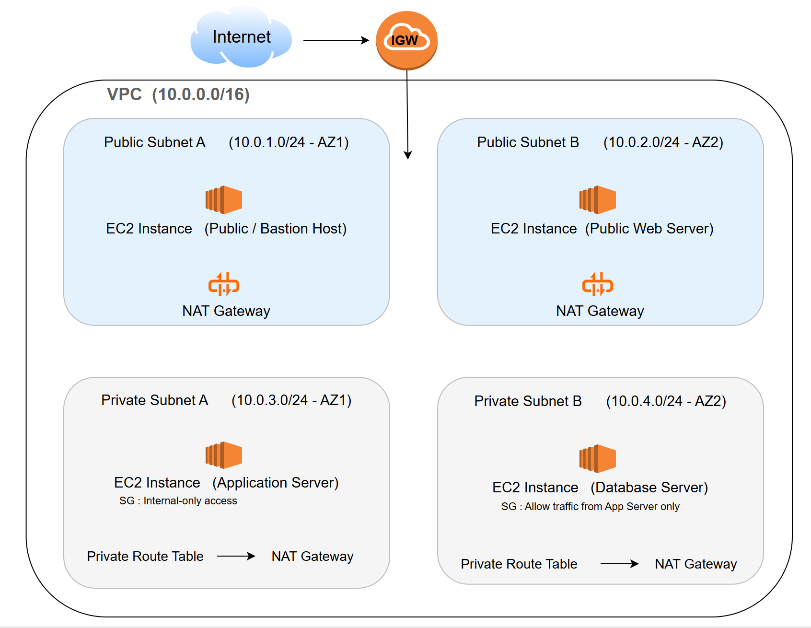

---

## 📸 Screenshots

### VPC Overview
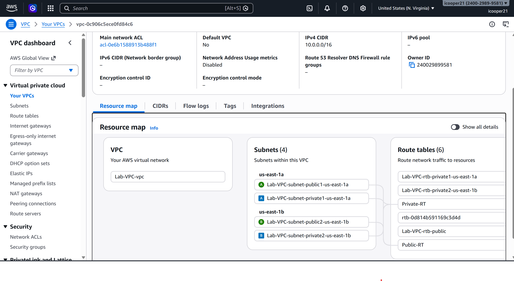

### Subnet Layout
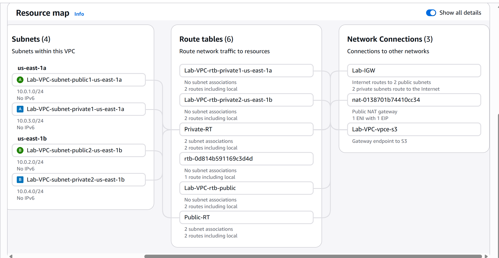

### Route Tables
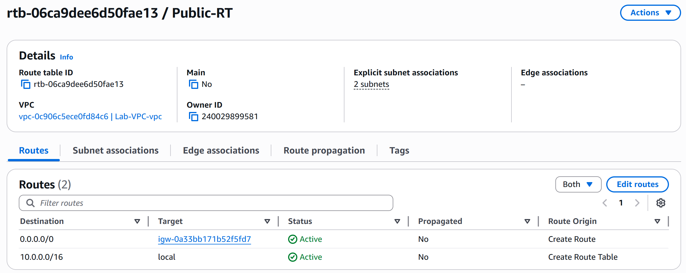  
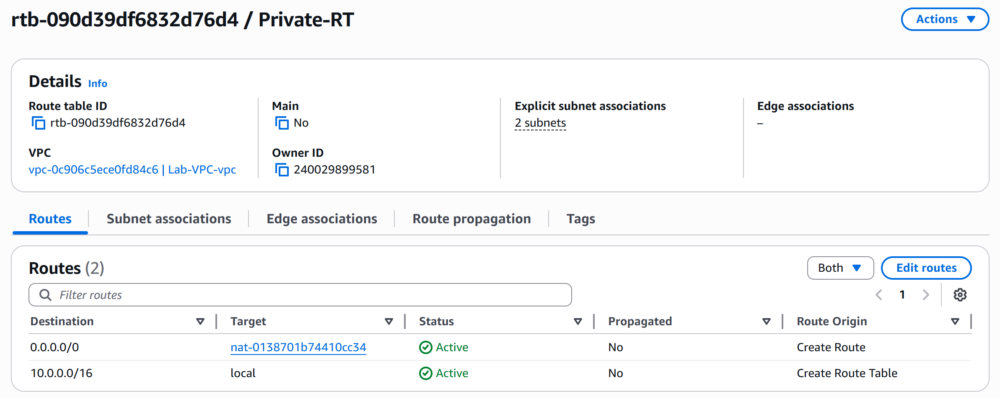

### Internet Gateway
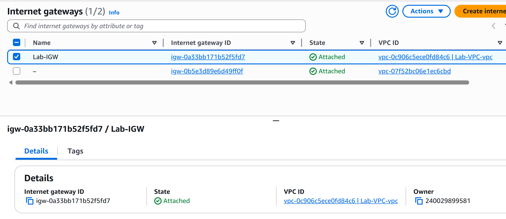

### NAT Gateway
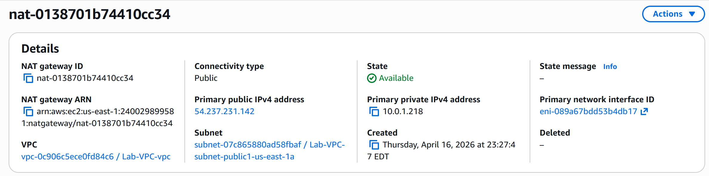

### Security Groups
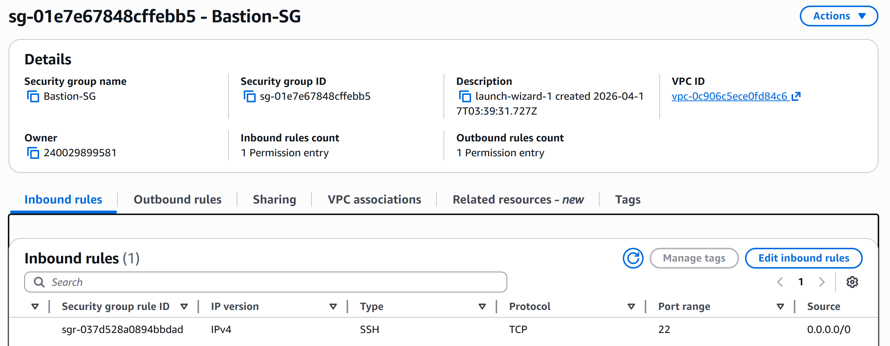  
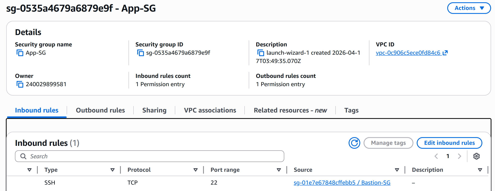  
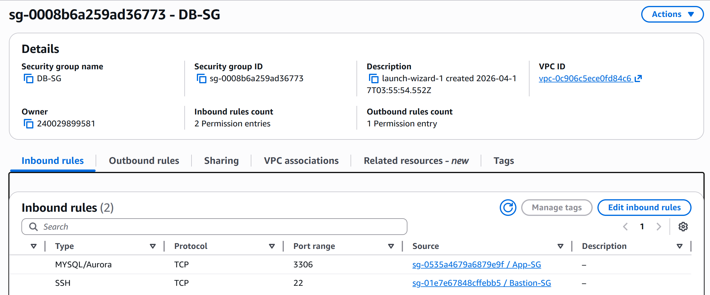

### EC2 Instances
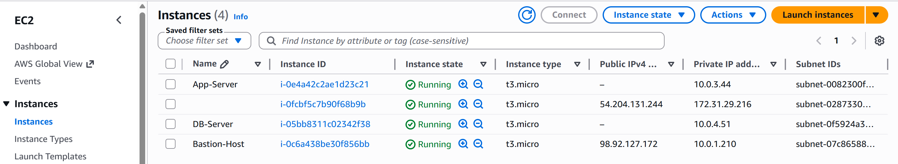

### Connectivity Test
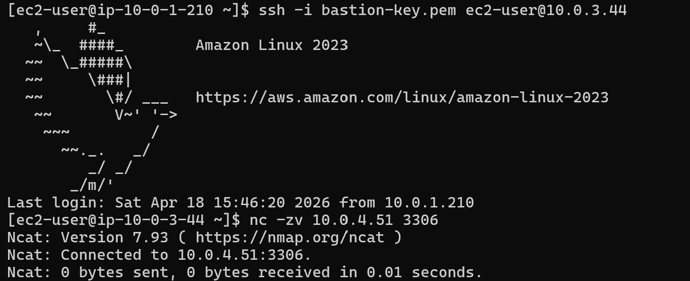

---

## 🧠 Key Skills Demonstrated

- AWS VPC design and subnetting
- Route table configuration
- Internet Gateway and NAT Gateway setup
- Security Group least-privilege access control
- Multi-tier cloud architecture design
- Secure EC2-to-EC2 communication

---

## 🚀 Outcome

This project demonstrates the design of a production-style AWS network architecture emphasizing security, segmentation, and controlled access between application tiers.
